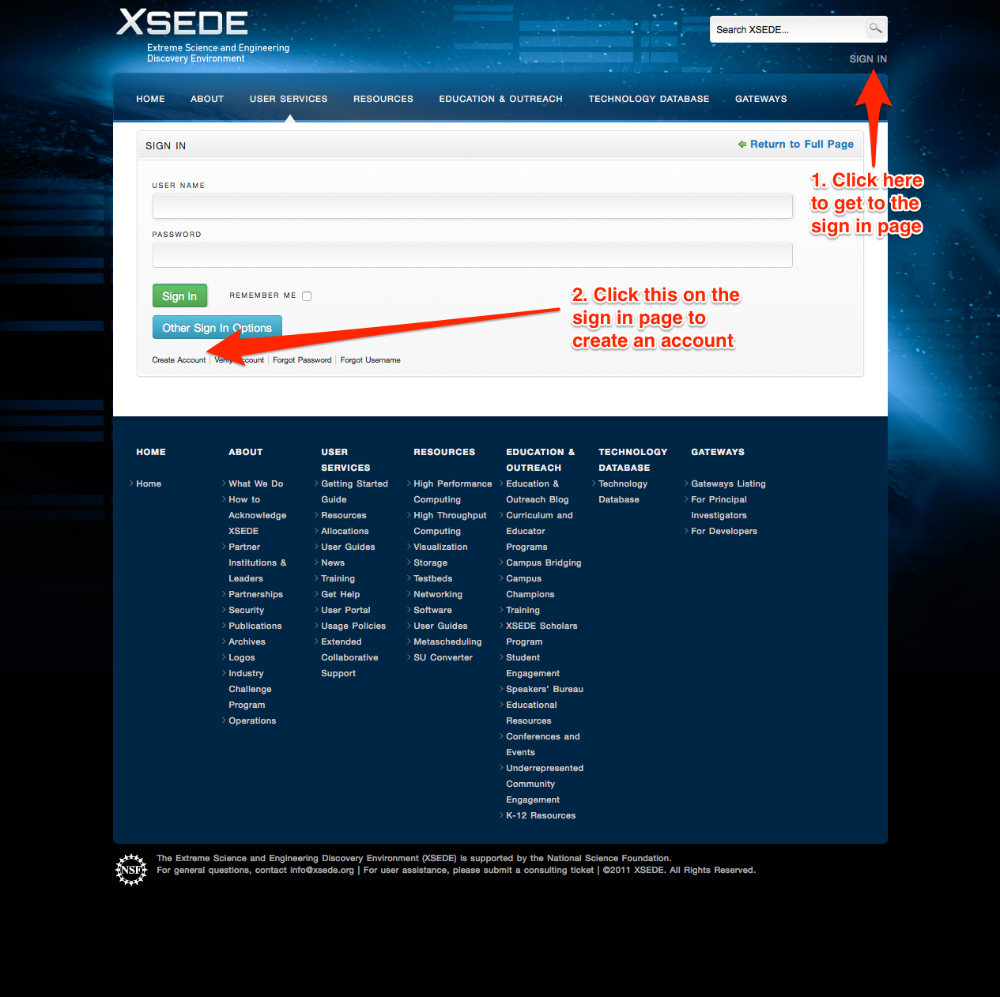

LaTeX input:        mmd-mavrldoc-header
Title:              NANO266 General Lab Instructions
Author:             Shyue Ping Ong
Affiliation:        University of California, San Diego
Address:            9500 Gilman Drive, Mail Code 0448, La Jolla, CA 92093-0448
Web:                http://www.materialsvirtuallab.org
Base Header Level:  2
LaTeX Mode:         mavrldoc
LaTeX input:        mmd-mavrldoc-begin-doc
LaTeX footer:       mmd-mavrldoc-footer

# Introduction

Welcome to the lab sessions for NANO266. Before you begin, you should read this
carefully and follow all instructions to make sure that your computer /
computing resource is set up properly. Your instructors are on hand to help you
if you run into any problems.

# First Principles Modeling Codes

In the labs, we will be using two open-source first principles modeling codes:

1. NWchem (http://www.nwchem-sw.org) is a computational chemistry code that
   aims to be scalable both in their ability to treat large scientific
   computational chemistry problems efficiently.
2. QuantumEspresso (http://www.quantum-espresso.org/) is an integrated suite of
   computer codes for electronic-structure calculations and materials modeling
   at the nanoscale. It is based on density-functional theory, plane waves, and
   pseudopotentials.

Before you start any of the labs, make sure that you have the software
installed and in your path. You have four options:

## Option 1: Use XSEDE



We have secured an XSEDE allocation for this course. Please go the the XSEDE
portal (https://portal.xsede.org) and create an account as shown above.
After you have done so, email your username to one of the TAs to be added
to the allocation for this course. You can then login to the allocations
with

```bash
ssh <your_username>@comet.sdsc.edu
```

If you are on a Windows machine, you need to download a SSH client like
[PuTTY](http://www.chiark.greenend.org.uk/~sgtatham/putty/download.html).
Once you are logged in, immediately run

```bash
module load qe nwchem python
export NWCHEM_BASIS_LIBRARY=/opt/nwchem/data/libraries/
```

to make sure that QuantumEspresso, NWChem and Python are loaded for you and
that the libraries are set properly. You can also add these two lines to
your `.bash_profile` so that it will always be loaded for you when you login.

## Option 2: Set up your own Mac

If you have your own Mac, you can use the executables already included in
this repo (see cloning the repo section). Run the following command to add
the bin directory to your path as follows (assuming you are on bash):

```bash
export PATH=$PATH:<path/to/repo>/bin/Mac
# The following is to set the NWChem basis sets used in lab1.
# Be careful that the ending slash is needed!
export NWCHEM_BASIS_LIBRARY = <path/to/repo>/resources/nwchem_basis/
```

## Option 3: Use a Virtual Machine

You can download VirtualBox (https://www.virtualbox.org/), and a
pre-configured Ubuntu virtual machine at this [link](https://s3.amazonaws.com/mavrl-web/nano266.ova).

Note that it is a hefty 3 Gb download, so you will want to download this on
a fast connection. After launching VirtualBox, do File->Import Appliance and
then select the downloaded `nano266.ova` file. You can then start the
virtual machine. You should be able to login to the virtual machine without
a password. If one is ever needed, it is simply "nano266fun". Start a
terminal by clicking on the icon on the left. By typing `ls`, you should see
that a nano266 directory is already cloned for you. Simply `cd nano266` and
you are ready to begin to do the labs.


## Option 4: Compile your own

You can download the source code for QuantumEspresso or NWChem and install
it yourself. *Attempt this only if you have a fairly good familiarity with
compiling things on Unix-based OSes, or are willing to spend the time to
figure it out!* If you foresee you will be working on such calculations
extensively in future, it is generally useful for you to learn how to do
this. Start with the QuantumEspresso code as it is more straightforward to
compile.

In general, it is not recommended that you run on a native Windows OS for these
labs. Most first principles codes are designed to run primarily on
supercomputing clusters that have Unix-based OSes. If you have a Windows
machine, you should try options 1 or 3 above.

# Cloning the repo

On wherever you are performing the calculations for the lab, you should clone
this repo by doing:

```
git clone https://github.com/materialsvirtuallab/nano266.git
```

Check that you have the repo cloned successfully by doing a `ls`. If you are
using XSEDE, make sure that you do the git clone in your home folder, i.e.,
the folder that you are in when you first log into XSEDE. This makes following
the rest of the instructions much easier.

This assumes you already have git installed, which comes by default in XSEDE
and Mac and can easily be installed in Unix-based OSes. To update your repo to
the latest version at any time, you can do:

```
git pull
```

from within the repo.

# Using a Unix-based terminal

If you have never used a Unix-based terminal, there is a bit of a slight
learning curve. But in general, you will be working with only four or five
commands:

```bash
cd <dirname>       # change directory to <dirname>
cp <file1> <file2> # copies <file1> to <file2>
mv <file1> <file2> # moves <file1> to <file2>
rm <file>          # remove <file>
```

You will also be doing some basic text editing in the terminal. For beginners,
the `nano` command line editor has the smallest learning curve. Other options
are `vi` and `emacs`.

Finally, you will need to get your results over to your local computer to do
analysis. The easiest way to do this is with:

```bash
scp <username>@trestles.sdsc.edu:~/nano266/location/of/file .
```

in your local Mac or Linux terminal. If you are on Windows, the equivalent is
[pscp](http://www.chiark.greenend.org.uk/~sgtatham/putty/download.html).

# Programming in Python

A lot of the labs use Python as a scripting language for automating
calculations and analysis. You should ensure that you have Python 2.7.x
installed with numpy. If you have a Mac, this should be already the case. If
you use the virtual machine, it is also already set up.

If you don't know Python, get a quick primer from the official [Python
documentation](https://docs.python.org/2.7/). You do not really need to know
much more than the basics for the purposes of the labs. Learning how to use a
scripting language like Python can save you loads of time in automating
calculations.
